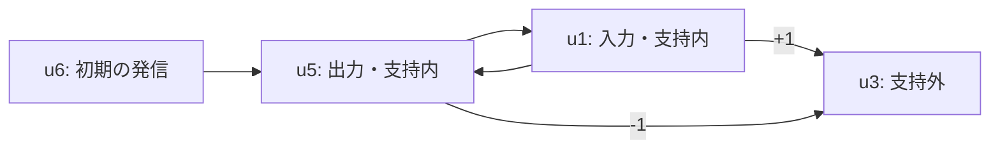

# RSB-AUDIT-002 — 測定由来の条件分離

2026-09-10、発信停止測定から全DC条件の同時成立と各条件だけの不成立を構成できた。
これは改訂2の観測と、明示した有限モデル類での結果。M1〜M4全体や現象性の認証ではない。

## 実行証拠

- `G3-circuits-20260910.log`: 初期測定器・探索テスト4146/4146。
- `G3-circuits-replay-20260910.log`: 再検証・固定証人を含め8286/8286。
- `search-four-unit.toml`: 2048回路×16初期配置=32768ケースの完全列挙。
- `search-six-unit.toml`: 固定LCG seed=20260910の20000ケース。完全列挙ではない。
- `replay-four-unit.log` / `replay-six-unit.log`: 全探索を再実行し、報告の内容digestが一致。
- `measured-witness-corpus-report.toml`: 固定した5証人を全介入集合で再測定した出力。
- `G3-witness-reduction-20260910.log`: 辺の削除と全介入再検証48/48。
- 全体G3: `../RSB-AUDIT-003/G3-full-20260910.log`、測定・対称性suiteを含むPkg.test()がexit 0で通過。
- 既存G1/G2/G4の依存はRSB-AUDIT-001から無変更。新規binding・certificate・台帳更新はない。

## 全条件と各条件の分離

共通の背景条件は、有限の同期閾値回路、非空で交わらない入出力役割、正閾値、
自己辺・重複辺・ゼロ辺なし、入力への辺は出力からのみ、外生駆動なし。
符号付き重みを許す。P=H=6、L=R=4。非退化条件は空でないproper Kと空でないε。
境界が真の証人では、支持外への辺に実際の介入差があることも要求する。
モデルごとの回路や初期配置は異なるが、測定定義とこの背景条件は共通。

| 証人 | hSelf | hSMC | hAct | hBound | 元の探索 | case ID |
|---|---|---|---|---|---|---|
| 全条件 | T | T | T | T | 6-unit sequence | 754 |
| hSelfのみ不成立 | F | T | T | T | 6-unit sequence | 677 |
| hSMCのみ不成立 | T | F | T | T | 6-unit sequence | 3218 |
| hActのみ不成立 | T | T | F | T | 6-unit sequence | 2489 |
| hBoundのみ不成立 | T | T | T | F | 4-unit exhaustive | 549 |

固定入力は `tools/model_audit/fixtures/measured-witnesses.toml`。
4-unit域ではhSelfのみ/hActのみの非退化証人は見つからず、6-unitの列ではhBoundのみが見つからなかった。
域を越えた不可能性や、出現割合に基づく自然界での頻度を推定しない。

## 辺を減らした読みやすい例

`reduce-measured-witnesses.jl` は役割・閾値・初期状態・観測窓を固定して辺だけを削除する。
各削除の受理/拒否と前後digestを `reduced-witness-corpus-report.toml` に保存した。
最終的に、同じ条件で残るどの1辺を削除しても判定または非退化/境界条件を失うことを検査した。
これは1辺削除に関する局所的な最小性であり、全モデル中の最小回路という主張ではない。

辺数は全条件18→5、hSelf不成立20→10、hSMC不成立19→9、hAct不成立18→7、hBound不成立2→2。
以下は削減後の全条件モデルの有効な配線（u2/u4は孤立してoff）。



u6は分岐前にoffになるが、立ち上がりには寄与する。以後はu1/u5が活動を維持する。
K={u1,u5}、ε={u1}、Act={u5}。u5の発信停止でu3の抑制が外れ、支持外にも差が出る。
初期寄与と分岐後の維持寄与を混同せず、境界を身体・膜の認証と解釈しない。

削減後のhSelf不成立例では、Φ(K)={u1}に対してK={u1,u5}なのでu5が覆われない。
hSMC不成立例ではσ(ε)が非空でも、その出力から最終点差分として得るαが空になる。
hAct不成立例では支持側ρ*(K)={u5}、入力側σ*(ε)={u6}となり、各側が非空でも交差しない。
hBound不成立例はu1↔u3の閉じた活動で、proper Kだが支持外への辺がない。

## 再実行

```bash
julia --project=. bin/eriec-model-audit.jl measured-witnesses
julia --project=. bin/eriec-model-audit.jl measure CIRCUIT.toml
julia --project=. bin/eriec-model-audit.jl verify-measurement REPORT.toml
julia --project=. bin/eriec-model-audit.jl search four_unit_exhaustive
julia --project=. bin/eriec-model-audit.jl search six_unit_sequence
julia --project=. bin/eriec-model-audit.jl verify-search REPORT.toml
```

再検証は保存済み判定・trace・網羅性申告を信用せず再計算する。
回路入力は2〜10ユニット、P/H≤256に制限する。これは観測ツールの資源上限。
source maskと初期配置はユニット順のLSB index。探索case IDは0始まり。

追記: RSB-AUDIT-007で汎用回路入力と全停止集合の資源上限を12ユニットへ拡張した。
この実行記録の探索域や候補数、過去に保存した結果は変更していない。
